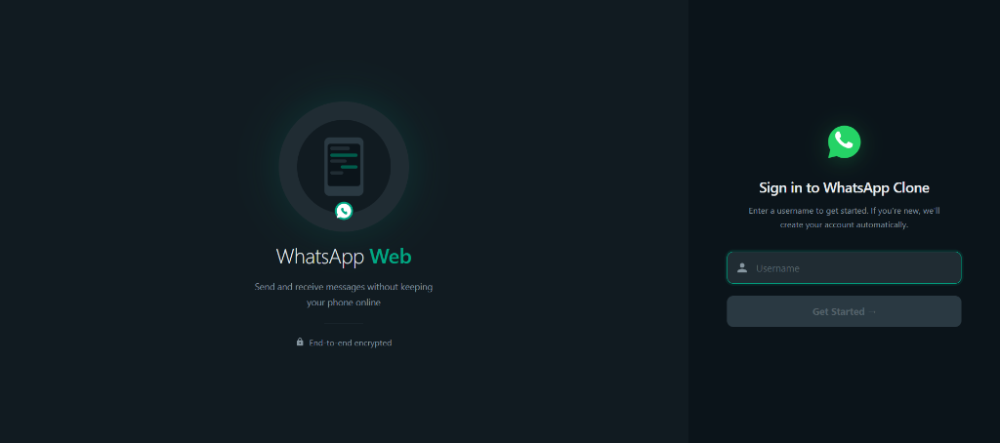
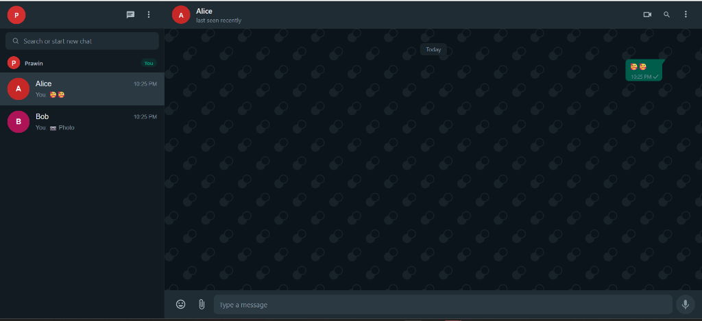
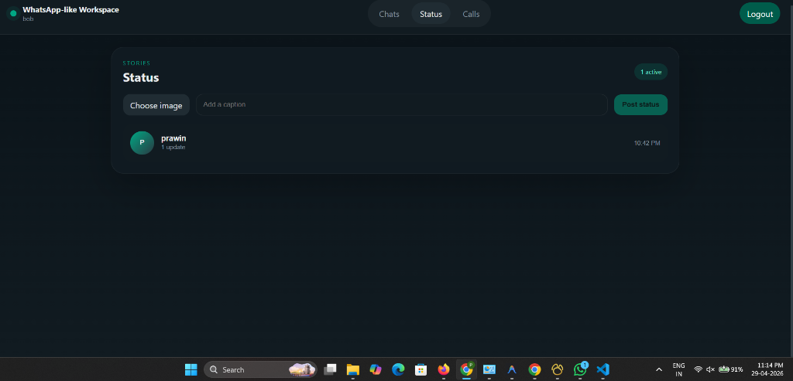

# 🚀 WhatsApp Web Clone (Full Stack Real-Time Chat Application)

A professional-grade, full-stack real-time messaging application inspired by WhatsApp Web. This project demonstrates modern web development practices, real-time communication protocols, and a scalable architecture.

> **Note**: This project is a simplified WhatsApp Web clone built to satisfy the core requirements of the assignment. Additional features are included as enhancements.

---

## 📖 Overview

*   **Purpose**: To provide a seamless, real-time communication platform that mimics the core experience of WhatsApp Web.
*   **Problem Solved**: Addresses the need for instant, persistent, and secure messaging between users with live feedback (typing indicators, read receipts).
*   **What was built**: A complete MERN-based chat ecosystem featuring real-time state synchronization, persistent database storage, and a polished, responsive user interface.

---

## ✅ Task Requirement Mapping

### 1. User Setup
*   **Username-based Login**: Users can join the platform by providing a unique username.
*   **Unique Identification**: Every user is assigned a unique MongoDB identifier for consistent relationship mapping.
*   **Multi-user Support**: The system architecture supports multiple concurrent users.

### 2. Chat Interface
*   **Two-panel Layout**: Sidebar for contact selection and a dedicated chat window for conversations.
*   **Active Chat Highlighting**: Visual feedback when selecting different users.
*   **Message UI**: Distinct styling for sent vs. received messages with timestamps and status icons.
*   **Auto-scroll**: The chat window automatically scrolls to the most recent message.

### 3. Messaging Functionality
*   **Message Persistence**: All messages are stored in MongoDB and persist after page refreshes.
*   **Conversation Fetching**: Retrieves history specific to the selected peer.
*   **Chronological Order**: Messages are displayed in strict order of creation.
*   **Metadata**: Each message is associated with a sender, receiver, and timestamp.

### 4. Backend APIs
*   `POST /api/users`: Create or find a user by username.
*   `GET /api/users`: Retrieve registered users for the contact list.
*   `POST /api/messages`: Send and persist a new message.
*   `GET /api/messages/:senderId/:receiverId`: Fetch the full history between two users.
*   **Standards**: Implementation uses proper HTTP status codes and JSON responses.

### 5. Real-Time Updates
*   **Socket.IO**: Leverages WebSockets for instant, bi-directional communication.
*   **Live Rendering**: Messages appear on the recipient's screen immediately without page polling or refresh.

### 6. Application Structure
*   **Clean Separation**: Modular `client` (React) and `server` (Node/Express) directories.
*   **Reusable Components**: Component-based React architecture.
*   **Mongoose Schemas**: Organized data models for Users and Messages.

---

## ✨ Features

### Core Features
*   **Real-time Messaging**: Instant text delivery via WebSockets.
*   **Persistent History**: Full conversation storage in MongoDB.
*   **User Presence**: Live "Online" status tracking for all users.
*   **WhatsApp UI**: Clean, responsive layout inspired by the original web app.

### Enhancement Features (Prototypes)
*   **Emoji Support**: Integrated emoji picker for messages.
*   **Typing Indicators**: Real-time feedback when the other user is typing.
*   **Read Receipts**: Visual status for Sent, Delivered, and Read messages.
*   **Basic Group Chat Support**: Logic for multi-user conversation handling.
*   **Call Signaling (UI Simulation)**: Interface and signaling logic for initiating voice/video calls.
*   **Status UI Prototype**: Early-stage interface for sharing and viewing status updates.
*   **Message Management**: Features for reacting to or deleting messages.

---

## 🧰 Tech Stack

| Layer | Technology |
| :--- | :--- |
| **Frontend** | React, Vite, React Router, Tailwind CSS, Axios |
| **Backend** | Node.js, Express, Socket.IO |
| **Database** | MongoDB, Mongoose |
| **Real-time** | WebSockets (Socket.IO) |
| **DevOps** | Docker, Docker Compose |

---

## 📂 Project Structure

```bash
├── client/               # React application (Vite)
│   ├── .env.example      # Client environment template
│   ├── public/           # Static assets & screenshots
│   └── ...               # Components and Features
├── server/               # Node.js Express server
│   ├── .env.example      # Server environment template
│   └── ...               # Models, Routes, and Logic
├── docker-compose.yml    # Orchestration for App & DB
└── package.json          # Project scripts and dependencies
```

---

## ⚙️ Setup Instructions

### Local Setup

1.  **Install Dependencies**:
    ```bash
    pnpm install
    ```

2.  **Configure Environment**:
    *   Copy `server/.env.example` to `server/.env`
    *   Copy `client/.env.example` to `client/.env`

3.  **Run Development Server**:
    ```bash
    pnpm dev
    ```
    *   The app will be available at `http://localhost:8080`.

---

### 🐳 Docker Setup

Run the entire stack (App + DB) with a single command:
```bash
docker-compose up --build
```
*   **Frontend**: `http://localhost:5173`
*   **Backend**: `http://localhost:5000`
*   **MongoDB (Host Port)**: `27018` (Avoids conflict with local MongoDB on 27017)

---

## 📡 API Endpoints

*   `POST /api/users`: Create/Login user.
*   `GET /api/users`: List all users.
*   `POST /api/messages`: Send a message.
*   `GET /api/messages/:sId/:rId`: Get chat history.

---

## 📸 Screenshots





---
**Developed by [Prawinkumar](https://github.com/prawinkumar2k)**
