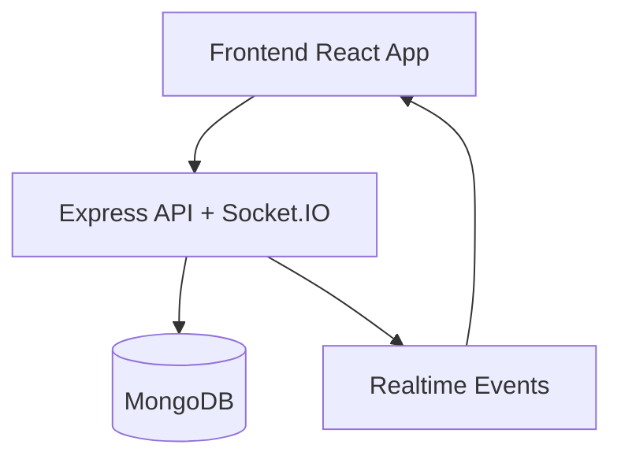
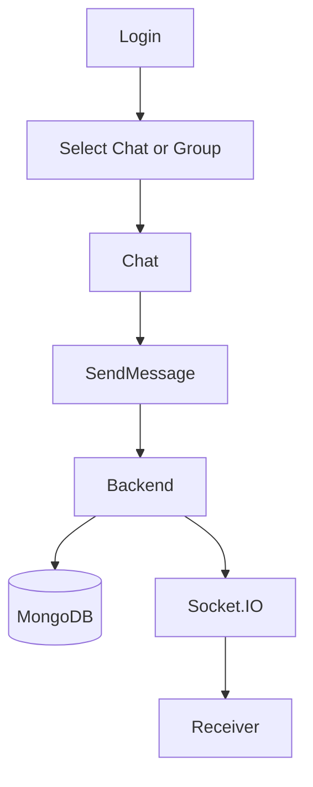
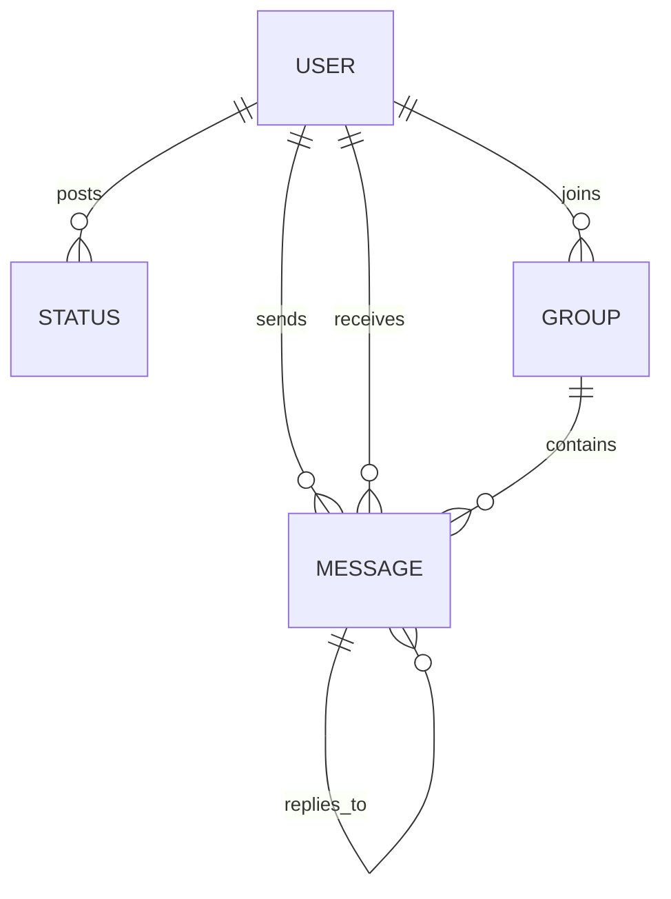

# WhatsApp Web Clone (Full Stack Real-Time Chat Application)

A production-ready WhatsApp Web–style chat application built with React, Express, MongoDB, and Socket.IO. The project focuses on a stable real-time chat core, a clean modular architecture, and a simple Docker-based startup flow.

## Overview

This project demonstrates a full-stack real-time communication system where users can create or identify themselves by username, open chats, and exchange messages instantly. Messages are persisted in MongoDB, synchronized over Socket.IO, and rendered in a WhatsApp-like interface with a sidebar, chat window, and workspace tabs.

The application is intentionally structured to look and feel production-ready while staying simple and reliable. Core chat is fully functional, and the advanced areas are implemented as clean modules or simulated flows where appropriate.

## Task Requirement Mapping

### 1. User Setup

- Users are created or identified using a username
- Each user has a unique MongoDB `_id`
- Multiple users are supported
- Login is handled through a simple username-based flow

### 2. Chat Interface

- Two-panel layout with sidebar + chat window
- Active conversation highlighting
- Sent and received messages are visually distinct
- Auto-scroll keeps the latest message visible

### 3. Messaging Functionality

- Text messages are sent between users
- Messages are stored in MongoDB
- Conversations are fetched by selected user
- Messages render in chronological order
- Messages persist after refresh
- Each message is associated with sender, receiver, timestamp, and status

### 4. Backend APIs

- `POST /api/users`
- `GET /api/users`
- `POST /api/messages`
- `GET /api/messages/:user1/:user2`
- Input validation and error status codes are implemented

### 5. Real-Time Updates

- Socket.IO is used for realtime messaging
- Messages render instantly without page refresh
- Typing indicators, read receipts, and deletion sync are handled live

### 6. Application Structure

- Frontend and backend are separated into `frontend/` and `backend/`
- The UI is split into reusable components and feature modules
- MongoDB schemas are defined cleanly in the backend

## System Architecture



### How it works

- The frontend handles rendering, user interaction, and local UI state.
- The backend handles authentication-by-username, message storage, status data, groups, and call session records.
- MongoDB stores users, messages, status updates, groups, and simulated call sessions.
- Socket.IO keeps message delivery, typing, presence, reactions, and simulated call updates in sync.

## Application Flow



## Features

### Core Features

- Real-time 1:1 messaging
- Persistent message storage
- WhatsApp-like dark UI
- Sidebar with last message previews
- Unread badges
- Typing indicator
- Read receipts
- Reply to message
- Delete message
- Message reactions
- Image sharing with preview
- Browser notifications for hidden tabs
- Auto-scroll to latest message
- Online/offline presence tracking

### Additional Features

- Workspace tabs for Chats, Status, and Calls
- Status stories with 24-hour expiry logic
- Group chat data model and routing
- Simulated call sessions with accept/reject/end states

## Tech Stack

| Layer | Tech |
| --- | --- |
| Frontend | React, Vite, React Router, Axios, CSS |
| Backend | Node.js, Express |
| Database | MongoDB, Mongoose |
| Realtime | Socket.IO |
| DevOps | Docker, docker-compose |

## Project Structure

```text
frontend/
  App.jsx
  main.jsx
  index.html
  components/
  features/
  lib/
  pages/
  public/
  services/
  styles/

backend/
  index.js
  node-build.js
  Dockerfile
  models/
  modules/
  utils/

docker-compose.yml
README.md
package.json
vite.config.js
vite.config.server.js
```

## Setup Instructions

### Requirements

- Node.js 20+
- pnpm
- MongoDB, or Docker

### Local Setup

```bash
git clone <repo-url>
cd realtime-chat-app-db7
pnpm install
```

Create a root `.env` file:

```env
PORT=5000
MONGO_URI=mongodb://127.0.0.1:27017/whatsapp-clone
CLIENT_URL=http://localhost:8080
VITE_API_URL=
```

Run the app:

```bash
pnpm dev
```

Open the app in two browser windows and sign in with any usernames you want. `alice` and `bob` are seeded automatically as starter accounts.

### Docker Setup

```bash
docker-compose up --build
```

This starts:

- Frontend on `http://localhost:5173`
- Backend on `http://localhost:5000`
- MongoDB on `mongodb://localhost:27017`

## Environment Variables

### Backend

- `PORT` - backend port
- `MONGO_URI` - MongoDB connection string
- `CLIENT_URL` - allowed frontend origin for CORS

### Frontend

- `VITE_API_URL` - API base URL for separate frontend deployments

Docker helper files:

- `backend/.env.docker` uses `MONGO_URI=mongodb://mongo:27017/chatapp`
- `frontend/.env.docker` uses `VITE_API_URL=http://server:5000`

## API Endpoints

### Health

- `GET /api/ping`

### Users

- `POST /api/users` - create or find a user by username
- `GET /api/users` - list users

### Messages

- `POST /api/messages` - send a direct or group message
- `GET /api/messages/:user1/:user2` - fetch direct chat history
- `GET /api/messages/group/:groupId` - fetch group messages
- `POST /api/messages/read` - mark direct messages as read
- `DELETE /api/messages/:messageId` - delete your own message
- `PATCH /api/messages/:messageId/reactions` - add or toggle a reaction

### Status

- `GET /api/statuses` - list active statuses
- `POST /api/statuses` - create a status
- `POST /api/statuses/:statusId/view` - mark a status as viewed

### Groups

- `GET /api/groups?memberId=...` - list groups for a member
- `POST /api/groups` - create a group
- `PATCH /api/groups/:groupId/members` - add or remove members

### Calls

- `GET /api/calls?userId=...` - list simulated call sessions
- `POST /api/calls` - create a simulated call session
- `PATCH /api/calls/:callId` - update call status

## Database Design



### Main Collections

- `User`
  - `username`
  - `isOnline`
  - `lastSeen`
- `Message`
  - `senderId`
  - `receiverId`
  - `groupId`
  - `text`
  - `image`
  - `replyTo`
  - `reactions[]`
  - `status`
- `Status`
  - `userId`
  - `mediaUrl`
  - `caption`
  - `viewedBy[]`
  - `expiresAt`
- `Group`
  - `name`
  - `members[]`
  - `admin`
  - `description`
- `CallSession`
  - `initiatorId`
  - `receiverId`
  - `status`
  - `callType`

## DevOps

- Dockerized frontend and backend
- MongoDB container support
- Single-command startup with `docker-compose up --build`
- Vite proxying is configured for Docker-based local development

## Performance & Behavior

- Conversation data is fetched only when a thread is selected
- Socket.IO reduces the need for repeated polling
- Message state updates are handled incrementally for smoother UI behavior
- The MongoDB connection includes a retry loop for container startup reliability

## Future Enhancements

- Rich status story viewer controls
- Group chat composer and group management UI
- Incoming call popups with a fuller call state overlay
- Cloud media storage adapter
- Message search across conversations

## Screenshots

Add project screenshots here if you want to include them in the final submission.

## Contribution

Contributions are welcome if they keep the codebase simple, stable, and consistent with the current architecture.

## License

MIT
