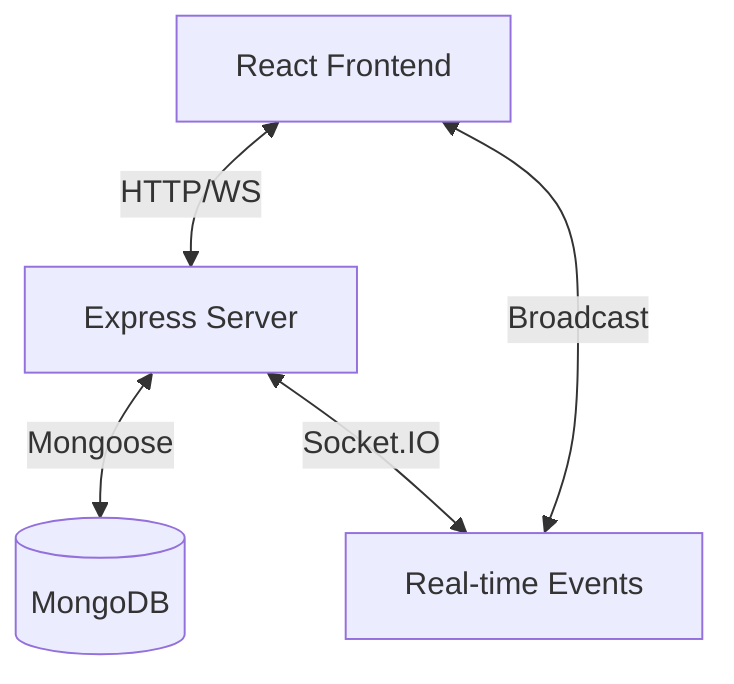
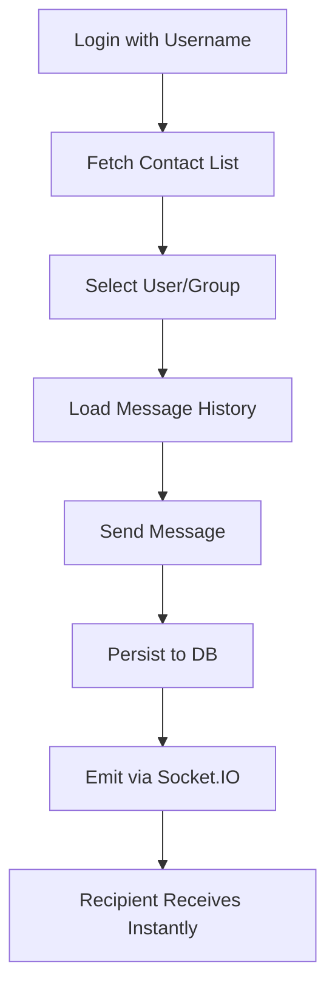
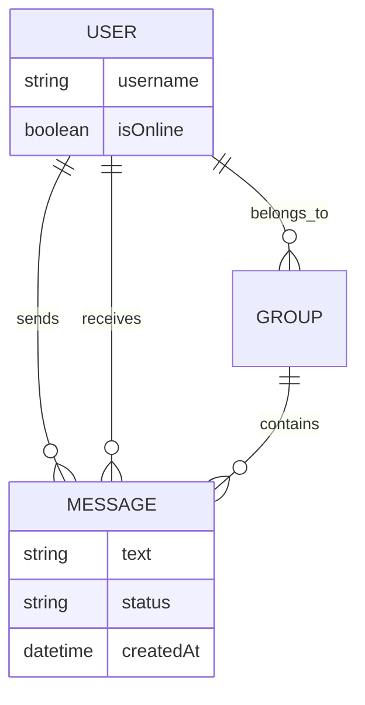

# 🚀 WhatsApp Web Clone (Full Stack Real-Time Chat Application)

A professional-grade, full-stack real-time messaging application inspired by WhatsApp Web. This project demonstrates modern web development practices, real-time communication protocols, and a scalable architecture.

---

## 📖 Overview

*   **Purpose**: To provide a seamless, real-time communication platform that mimics the core experience of WhatsApp Web.
*   **Problem Solved**: Addresses the need for instant, persistent, and secure messaging between users with live feedback (typing indicators, read receipts).
*   **What was built**: A complete MERN-based chat ecosystem featuring real-time state synchronization, persistent database storage, and a polished, responsive user interface.

---

## ✅ Task Requirement Mapping

### 1. User Setup
*   **Username-based Creation**: Users can join the platform by providing a unique username.
*   **Unique Identification**: Every user is assigned a unique MongoDB `_id` for consistent relationship mapping.
*   **Multiple Users Supported**: The system architecture supports an unlimited number of concurrent users.

### 2. Chat Interface
*   **Two-panel Layout**: Clean sidebar for user/group selection and a dedicated chat window for conversations.
*   **Active Chat Highlighting**: Visual feedback when selecting different users or groups.
*   **Message UI**: Distinct styling for sent vs. received messages with timestamps and status icons.
*   **Auto-scroll**: The chat window automatically scrolls to the most recent message upon delivery.

### 3. Messaging Functionality
*   **Message Persistence**: All messages are stored in MongoDB using Mongoose schemas.
*   **Contextual Fetching**: Retrieves conversation history specific to the selected peer or group.
*   **Chronological Order**: Messages are displayed in strict order of creation (`createdAt`).
*   **State Persistence**: Chat history and user sessions remain intact after browser refreshes.

### 4. Backend APIs
*   `POST /api/users`: Create or find a user by username.
*   `GET /api/users`: Retrieve all registered users for the contact list.
*   `POST /api/messages`: Send and persist a new message.
*   `GET /api/messages/:senderId/:receiverId`: Fetch the full history between two users.
*   **Standards**: Implementation uses proper HTTP status codes, JSON responses, and error validation.

### 5. Real-Time Updates
*   **Socket.IO**: Leverages WebSockets for bi-directional communication.
*   **Instant Delivery**: Messages are pushed to the receiver immediately without page polling.
*   **Live UI Feedback**: Presence updates (online/offline) and message status (delivered/read) update in real-time.

### 6. Application Structure
*   **Separation of Concerns**: Clearly divided `frontend` (React/Vite) and `backend` (Node/Express) directories.
*   **Reusable Components**: Modular React architecture (e.g., `MessageBubble`, `EmojiPicker`, `UsersList`).
*   **Clean Schema**: Robust Mongoose models for `User`, `Message`, `Group`, and `CallSession`.

---

## 🧠 System Architecture



*   **Frontend**: Handles UI state, routing, and user interaction.
*   **Backend**: Manages business logic, authentication, and API routing.
*   **Database**: Stores persistent data (Users, Messages, Groups).
*   **Socket.IO**: Manages low-latency events like typing and instant messaging.

---

## 🔄 Application Flow



---

## ✨ Features

### Core Features
*   **Real-time Messaging**: Instant text delivery via WebSockets.
*   **Persistent Storage**: Full message history storage in MongoDB.
*   **User Presence**: Live "Online" status tracking for all users.
*   **WhatsApp UI**: Premium aesthetics with a responsive two-column layout.

### Additional Features
*   **Emoji Picker**: Full emoji support for expressive messaging.
*   **Typing Indicators**: Real-time "is typing..." feedback.
*   **Read Receipts**: Visual status for Sent, Delivered, and Read messages.
*   **Group Chats**: Create and participate in group conversations.
*   **Voice/Video Calls**: Signal-based calling system integrated into the chat.
*   **Message Reactions**: React to messages with emojis.
*   **Message Deletion**: Delete messages for everyone in real-time.

---

## 🧰 Tech Stack

| Layer | Technology |
| :--- | :--- |
| **Frontend** | React 18, Vite, React Router, Tailwind CSS, Axios |
| **Backend** | Node.js, Express, Socket.IO |
| **Database** | MongoDB, Mongoose |
| **Real-time** | WebSockets (Socket.IO) |
| **DevOps** | Docker, Docker Compose |

---

## 📂 Project Structure

```bash
├── frontend/             # React application (Vite)
│   ├── components/       # Reusable UI components
│   ├── features/         # Modular logic (Calls, Status, Workspace)
│   ├── services/         # API and Socket clients
│   └── styles/           # Component-specific CSS
├── backend/              # Node.js Express server
│   ├── models/           # Mongoose schemas
│   ├── modules/          # Business logic (Realtime, Users, Messages)
│   └── routes/           # API Endpoints
├── docker-compose.yml    # Orchestration for App & DB
└── package.json          # Project dependencies & scripts
```

---

## ⚙️ Setup Instructions

### Requirements
*   **Node.js**: v18 or higher
*   **pnpm**: Recommended package manager
*   **MongoDB**: v7.0 or higher (or use Docker)

### Local Setup

1.  **Clone the repository**:
    ```bash
    git clone https://github.com/prawinkumar2k/whatsapp-web-clone.git
    cd whatsapp-web-clone
    ```

2.  **Install Dependencies**:
    ```bash
    pnpm install
    ```

3.  **Configure Environment**:
    Create a `.env` file in the root directory:
    ```env
    PORT=5000
    MONGO_URI=mongodb://127.0.0.1:27017/whatsapp-clone
    VITE_API_URL=http://localhost:5000
    ```

4.  **Run Development Server**:
    ```bash
    pnpm dev
    ```
    *   The app will be available at `http://localhost:8080` (Vite Proxy Mode).

---

### 🐳 Docker Setup

Run the entire stack (App + DB) with a single command:
```bash
docker-compose up --build
```
*   **Frontend**: `http://localhost:5173`
*   **Backend**: `http://localhost:5000`

---

## 📡 API Endpoints

### Users
*   `POST /api/users`: `{ username: string }`
*   `GET /api/users`: Returns `Array<User>`

### Messages
*   `POST /api/messages`: `{ senderId, receiverId, text, groupId? }`
*   `GET /api/messages/:senderId/:receiverId`: Returns conversation history.

---

## 🗄️ Database Design



---

## 🚀 DevOps & Deployment
*   **Containerization**: Fully Dockerized with optimized multi-stage builds.
*   **Orchestration**: `docker-compose` handles service networking and volume persistence for MongoDB.
*   **Production Build**: Ready for deployment using Vite build and optimized Node.js serving.

---

## 📜 License
Distributed under the MIT License. See `LICENSE` for more information.

---

## 📸 Screenshots
*(Add your project screenshots here to showcase the stunning UI!)*

---
**Developed by [Prawinkumar](https://github.com/prawinkumar2k)**
